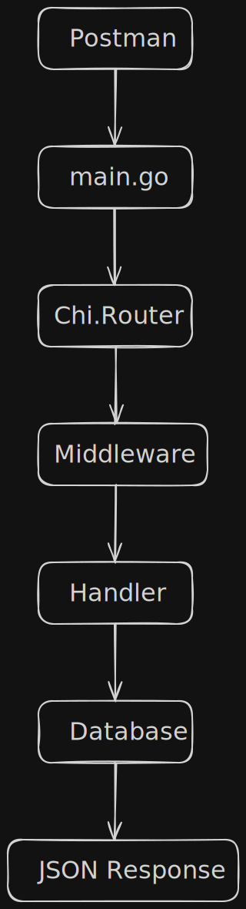

# Today I Learned

---

## Date

16-07-26

---

# Focus

- GO concepts and API

---

# Concepts Learned

## Channels in GO
- Channels in GO are simply a typed communicated pipe between goroutines
- Helps in manaing GOroutines so that they do not end up reading and writing data at the same spot at the same time by avoiding shared variable and instead sharing data through communicatipn and not commnicating data through sharing

### Why does it exist?
## Need for this 
If two routines want to access a variable to read  and write at the same time or if one action is performed before the other in wrong order reading before writing or re-write  before the other routine has even read once.
				The above case can be handled using mutexes, locks and race
prevention but `channels` avoid alot of that by encouraging communication instead of shared ownership


## BitTorrent example 
Imagine you have

```go
Peer 1

↓

piece 5

↓

Downloader
```

Instead of

```go
globalPieceBuffer
```

you could think

```go
Peer 1

↓

channel

↓

Piece Verifier
```

Another peer

```c
Peer 2

↓

channel

↓

Piece Verifier
```

The verifier doesn't care which peer produced it.

It simply receives pieces.


### Buffered vs UnBuffered

- If the communicated pipe has no storage, A can only hand something over if B is ready that's called unbuffered channel can only transport one data point at a time.
- If the pipe can hold data temporarily then that's called a buffered channel which can transport multiple data points at a time.

### Channels are first class value 
- a channel is also a value like 
	- int
	- string
	- *File
- Can pass it to functions
- store it in structs 
- return it


```md
G1

↓

channel

↓

G2
```


Good uses:

- worker pools
- pipelines
- producer-consumer patterns
- background jobs
- coordinating goroutines

Poor uses:

- replacing every function call
- passing configuration everywhere
- synchronizing unrelated state


###  a systems programmer perspective 

Think of these layers:

```md
C
----------------------------------
pthread
mutex
condition variable
shared memory

Go
----------------------------------
goroutine
channel

Unix
----------------------------------
process
pipe
```


A Go channel is **conceptually much closer to a Unix pipe than to a mutex**.

That's why people familiar with Unix often find channels intuitive—they're a language-level abstraction for passing typed values between concurrent execution contexts, much like pipes pass byte streams between processes.

---

## Generics in GO

Problem:

Without generics I'd write the same algorithm for

- int
- float32
- float64

Generics separate

- the algorithm
- the data type

Important realization:

[T ...]

declares a type parameter.

Constraints determine which operations are valid.

Examples:

any
    ↓
No assumptions about T.

int | float32 | float64
    ↓
Compiler knows + is legal.

---

## GO API

- cmd/api/main.go simply creates a chiMux Router object and passes it to the handler for handling and log any error it encounters
- handlers/api.go contains the Handler func that decides what to do with the request it first addes the middle ware then reoutes the request to get the coins data the request asked for
- middleware package contains the auth logic it simply parses the url and gets the username and token to match if the username and token matches and if they do it gets the login details and then does nil check logs error and return at every step and if not error the moves on to the next handler
- handlers/get_coin_balance.go is the real business logic it validates the request and reads the username, opens database, gets balance then return json
- tools pacakge is basically a mock database
- api/api.go is just data structure defined in one file to be used throughout the api logic




 # Things that finally clicked today

 - Middleware is code that executes before/after handlers.
- Chi routes are just request dispatchers.
- Generics parameterize algorithms, not values.
- Channels communicate typed values, not bytes.
